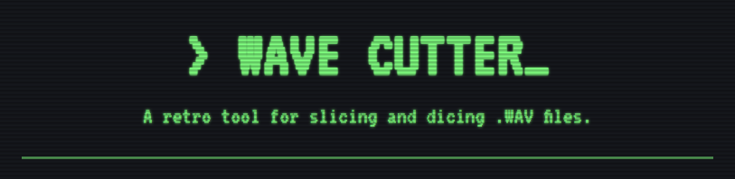

# &gt; WAVE CUTTER_

Wave Cutter is a retro-themed, browser-based tool for visualizing, slicing, and rearranging `.wav` audio files. It's built with modern web technologies and designed to feel like a piece of vintage audio software.

Whether you're a music producer looking to chop up breakbeats or just want to experiment with audio, Wave Cutter provides an intuitive interface for non-destructive audio editing right in your browser.



## Features

-   **Audio Loading**: Upload your own `.WAV` files or select from a list of pre-loaded classic breakbeats.
-   **Interactive Waveform Display**:
    -   Visualize the entire audio file's waveform.
    -   Zoom in and out using the mouse wheel for precision editing.
    -   Pan horizontally across the waveform with a scrollbar when zoomed.
-   **Slicing**:
    -   **Auto-Slice**: Automatically detect transients and create slices based on an adjustable amplitude threshold.
    -   **Manual Slice**: Click and drag on the waveform to create custom selections and turn them into slices.
-   **Slice Management**:
    -   **Playback**: Play individual slices once or loop them.
    -   **Rearrange**: Drag and drop slices to re-order your arrangement.
    -   **Edit**: Fine-tune the start and end times of each slice.
    -   **Manage**: Rename, duplicate, or delete individual slices.
-   **Playback Controls**:
    -   Play the original, full audio sample.
    -   Play the entire rearranged sequence of your slices.
-   **Export**:
    -   Download individual slices as separate `.wav` files.
    -   Download the complete, rearranged sequence as a single `.wav` file.

## Tech Stack

-   **Framework**: [Next.js](https://nextjs.org/) (App Router)
-   **Language**: [TypeScript](https://www.typescriptlang.org/)
-   **Styling**: [Tailwind CSS](https://tailwindcss.com/)
-   **UI Components**: [ShadCN UI](https://ui.shadcn.com/)
-   **Icons**: [Lucide React](https://lucide.dev/)
-   **Audio Processing**: Web Audio API

## Getting Started

Follow these instructions to get a copy of the project up and running on your local machine for development and testing purposes.

### Prerequisites

You need to have [Node.js](https://nodejs.org/en) (version 20 or later) and [npm](https://www.npmjs.com/) installed on your system.

### Installation

1.  **Clone the repository:**
    ```sh
    git clone https://github.com/your-username/wave-cutter.git
    cd wave-cutter
    ```

2.  **Install dependencies:**
    ```sh
    npm install
    ```

3.  **Run the development server:**
    ```sh
    npm run dev
    ```

The application will be available at `http://localhost:9002`.

## How to Use

1.  **Load an Audio File**:
    -   Click on one of the sample breakbeat buttons (e.g., "Amen Break").
    -   OR, click the upload box to select a `.wav` file from your computer.

2.  **Create Slices**:
    -   Use the **Auto-Slice** control to automatically generate slices. Adjust the threshold slider to change the sensitivity.
    -   OR, click and drag on the waveform to create a selection. Then, click the "Create Slice" button.

3.  **Manage Your Slices**:
    -   The created slices will appear in the "Slices" list on the right.
    -   Use the controls on each slice to play, loop, duplicate, download, or delete it.
    -   Click and drag the grip handle (`::`) to reorder the slices.
    -   Click "Play All" to hear your rearranged sequence.

4.  **Download Your Work**:
    -   Click the download icon on an individual slice to save just that slice.
    -   Click the main "Download" button at the top of the slice list to save your entire arrangement as a single file.
